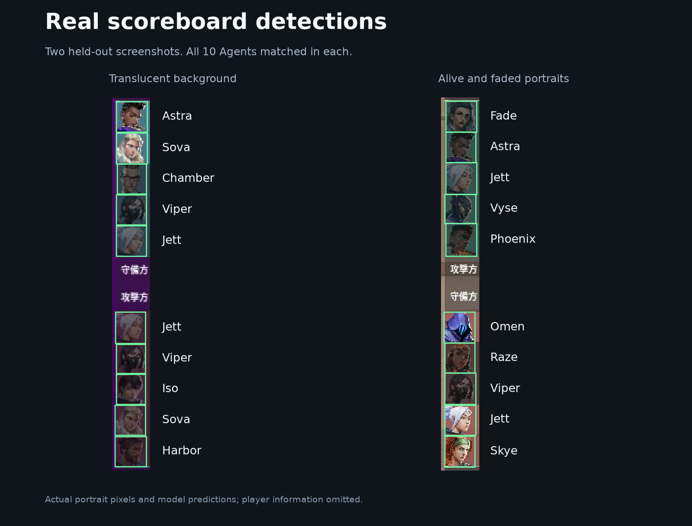

# Valorant Portrait Kit

Detect and identify Agent portraits in VALORANT scoreboards with
**YOLO26n + fixed-template matching**.



## Quick start

Python 3.12+. CPU inference requires no PyTorch, CUDA, or Ultralytics installation.

```sh
git clone https://github.com/Graphicmelon/valorant-portrait-kit.git
cd valorant-portrait-kit
python -m pip install -e .
valorant-portrait --source screenshots --output annotations
```

Accepts an image or directory. Outputs **JSON** (names and pixel boxes),
**YOLO labels** (normalized coordinates), and **annotated JPEGs**. Uncertain
candidates are recorded for review; [class IDs](models/scoreboard/classes.json)
are fixed.

## Model

| Stage | Approach |
|---|---|
| Localization | YOLO26n, one `avatar` class, approximately 2.5M parameters |
| Identity | 29 fixed portraits, masked grayscale correlation, small box refinements |
| Deployment | FP32 ONNX, static `1×3×800×800` input, approximately 10 MB detector |

RGB input is letterboxed and scaled to `[0,1]`. ONNX returns `[1,30,6]` rows:
`[x1, y1, x2, y2, score, class]`, with embedded NMS. Templates supply Agent names;
correlation and margin are similarities, not probabilities.

Trained on **37 real + 180 synthetic screenshots**, excluding development and
test imagery from training and synthesis. Weights, templates, settings, and
training/export tools are included; training data stays private.

## Validation and scope

Held-out test: **70 screenshots / 700 portraits**. Correct name and IoU ≥ 0.75:
**695/700**; **100% precision**, **99.29% recall**. **66/70** screenshots were
fully correct: five misses, zero incorrect names or extra boxes.

Requires a full scoreboard with one portrait column and at least four reliable
portraits. Isolated portraits and other HUD layouts are untested. Real coverage:
**24/29 classes**. Clove, Gekko, Miks, Reyna, and Tejo lack real test examples;
several others have only 1–4.

CPU latency: **75.7 ms median**, four threads, one development frame, 30 warmed
runs, excluding file decoding. See the [model card](docs/model-card.md) and
[evaluation](docs/evaluation.json) for details and limitations.

## License

[AGPL-3.0](LICENSE). Independent community project, unaffiliated with Riot Games.
Game artwork and marks retain their owners' rights; see
[third-party notices](THIRD_PARTY_NOTICES.md).
